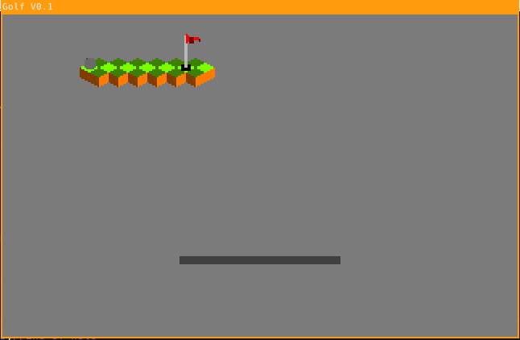

# Golf

Screenshot of current state when run.

## Dependancies
You will need the following if you want to use this in eclipse.
- [Fire Leaf Framework](https://www.github.com/h2n0/Game-Engine)

## What is this?
This is a super simple isometric renderer, which I will slowly make in to some sort of golf game.
